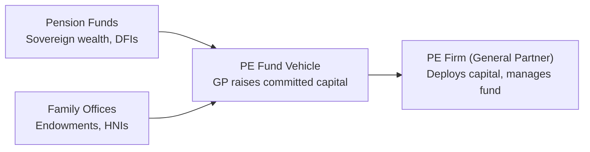
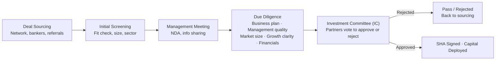
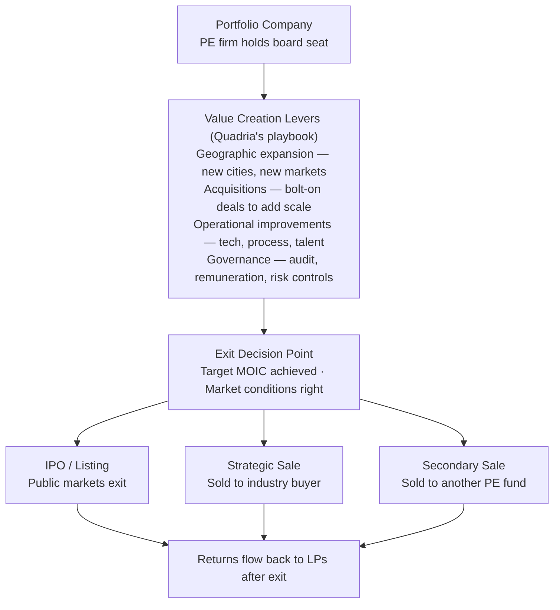

# Project Report

**Insights on Marketing Strategies of a Sector-Focused Private Equity Investment Firm**

Submitted by: Ritik Raj Singh (62)
Submitted to: Professor Prashant Kumar Jha
Date: March 16, 2026

## Abstract

This report provides an in-depth analysis of the traditional methods of relationship building and credibility building used to enhance long-term relationships with investors and portfolio companies, in an age of heavy and aggressive marketing strategies pushed by companies and organisations. These insights were obtained through a telephonic interview with Mr. Sunil Thakur, Partner at Quadria Capital. The findings show how investment firms can grow by focusing on one sector and doubling down on it.

## Introduction

In the financial sector, marketing strategies do not always follow the retail playbook, because a lot of this industry is not customer-facing in the traditional sense. A lot goes on in the background — it is not always about digital marketing; the principles of marketing, advertising, and branding are, for firms like this, expressed instead through deep expertise, sector knowledge, and stronger relationships with long-term clients. Through a simple telephonic interview with Mr. Sunil Thakur, Partner at Quadria Capital, this report brings together what was learned.

## Overview of Quadria Capital

Quadria Capital is a Singapore-based independent private equity firm founded in 2012 by Abrar Mir and Dr. Amit Varma, specializing in growth capital investments within the healthcare sector across South and Southeast Asia. Managing over US$4.3 billion in assets, the firm focuses on healthcare delivery, life sciences, medical technology, and services, targeting mid-sized, high-growth companies. Its distinguishing characteristic is that its partners and investment professionals combine medical, clinical, and financial expertise, making it a specialized platform.

The firm does not focus on early-stage startups — its primary focus is mid-market healthcare companies with revenues between INR 400–500 crores and INR 3,000–4,000 crores. These are profitable, cash-generating businesses that require growth capital to expand globally. One example is AIG Hospitals, Hyderabad.

## Objectives

1. Understanding how an investment flows in private equity.
2. How focusing on a single sector helps Quadria Capital stay on top of its game.
3. How strong relationships and deep sector-knowledge expertise outshine aggressive marketing.
4. Channels and mediums utilized to reach investors and portfolio companies.
5. Post-COVID adaptation.
6. Macroeconomic trends, demographics, and regulations turning into challenges.
7. Evolution of healthcare investing over the past twenty years.
8. How a healthcare company is valued.
9. Major trends shaping the future of healthcare investment in Asia.
10. Influence of AI in healthcare and investment decisions.

---

## 1. Investment at a Private Equity Firm

### Stage 1 — Fundraising

Before a PE firm can invest a single rupee, it needs to raise a fund from institutional investors called Limited Partners. This is itself a sales and marketing process.

*LPs commit capital for 7–10 yrs · GP charges ~2% mgmt fee + 20% carry*
*Quadria Fund IV: US$4B AUM across South & Southeast Asia healthcare*

### Stage 2 — Finding and Closing a Deal

Once the fund is raised, the GP deploys that capital into portfolio companies. This is the most labour-intensive part — it involves sourcing, screening, deep due diligence, and negotiating legal terms. Mr. Sunil described exactly this process in the interview.

*Deal funnel: ~100 deals screened → 3–5 closed per year*

### Stage 3 — Value Creation and Exit

Closing the deal is only the midpoint. The real work — and the real returns — come from what happens over the next 5–7 years inside the portfolio company, followed by a carefully chosen exit route.

---

## 2. Marketing Strategy Analysis

### Understanding the context: institutional vs. retail financial marketing

Before understanding Quadria through the lens of a marketing framework, it is important to first understand what kind of financial services firm it is, and who its actual customers are. Retail firms — mutual funds, insurance, personal loans (for example, Vedant Asset) — target millions of individual consumers through mass media. PE firms, by contrast, operate in an entirely B2B model. Quadria's clients are of two types:

- **Limited Partners (LPs):** Institutional investors such as pension funds, sovereign wealth funds, family offices, endowments, and development finance institutions who commit capital to Quadria's funds.
- **Portfolio Companies:** Mid-market healthcare businesses whose founders and promoters Quadria approaches for investment.

### The 7Ps framework, applied to an institutional context

| 7P Element | Meaning | Retail | Institutional (Quadria) |
|---|---|---|---|
| **Product** | Core offering | Savings account, SIP, insurance policy | Healthcare growth equity fund; sector expertise; value-add advisory post-investment |
| **Price** | Cost to client | Interest rates, fees, premiums | Management fee (~2%) + carried interest (~20%); aligned with LP's long-term return expectations |
| **Place** | Distribution channel | Branches, apps, agents, online portals | Singapore HQ; New Delhi office; direct engagement across South & Southeast Asia |
| **Promotion** | Communication & outreach | TV ads, digital campaigns, influencers | Industry conferences, healthcare forums, LP roadshows, referral networks; no social media advertising |
| **People** | Frontline representatives | Relationship managers, financial advisors | Partners with clinical + M&A + operational backgrounds; this is the product itself |
| **Process** | Service delivery system | Loan processing, KYC, claim settlement | Deal sourcing → due diligence → IC approval → SHA negotiation → value creation → exit |
| **Physical Evidence** | Tangible proof of service | Bank statement, policy document | Track record, AUM, portfolio exits, LP testimonials, case studies like AIG Hospitals |

### The B2B marketing model: why no need for social media?

One notable moment in the interview was raising the observation that Quadria Capital has no visible social media presence. Mr. Sunil explained that digital marketing is mainly relevant for retail, not for any institutional setup, and that the firm's presence is concentrated at conferences, network events, and industry forums — describing it as a fundamentally reference-driven market.

This aligns with how reputation functions in institutional PE: it compounds much like capital itself. Limited Partners recommend firms to peers, and founders who had positive experiences introduce the firm to fellow promoters — and that is how deal flow moves.

## 3. Sectoral Focus: Why Sector Beats Diversification

Quadria's exclusive focus on healthcare is far more than an investment thesis — it is a positioning strategy that functions as marketing in its own right. In a market where hundreds of private equity funds compete for deals and LP capital, a firm that has spent over a decade exclusively studying, investing in, and building healthcare businesses occupies a fundamentally different competitive position than a generalist fund that occasionally invests in healthcare.

This gives the firm three advantages:

1. **Credibility with founders and promoters**
2. **Proprietary deal flow and network effects**
3. **LP differentiation**

## 4. Macro Trends, Challenges, and the Path Ahead

The interview highlighted several macroeconomic and structural forces shaping both the investment thesis and how that thesis is communicated to investors:

- Rising incomes and ageing populations across Asia increase healthcare demand predictability.
- **Technology & AI:** AI-driven diagnostics, clinical decision support, and digital health platforms are opening new sub-sectors that Quadria actively monitors.
- **Policy environment:** Government initiatives around healthcare access (e.g., PMJAY) and medical device manufacturing incentives create regulatory tailwinds embedded in Quadria's investor pitch.
- **Post-COVID resilience:** Business continuity planning and management's ability to pivot are now explicit investment criteria, reflecting a shift in how resilience is marketed to risk-conscious LPs.

## Personal Learnings and Key Takeaways

This interaction with Mr. Sunil Thakur offered perspectives that go well beyond what a classroom or textbook can provide. Several insights stood out as particularly formative:

**Marketing at the institutional level is relationship architecture, not communication.** In retail financial services, marketing is about reach and persuasion. In private equity, it is about being present in the right rooms, at the right events, with the right reputation. The firm itself becomes the brand, and that brand is built through performance, not promotion.

**Sector specialisation is a moat, not a limitation.** Quadria's exclusive focus on healthcare might appear to restrict opportunity. In practice, it amplifies every competitive advantage, from deal origination to due diligence quality to LP trust. This reinforced that in complex, high-value markets, depth consistently outperforms breadth.

**The 7Ps are universal, but their expression is context-dependent.** Walking through how each marketing element applies to a PE firm was an exercise in abstract thinking. It highlighted that the frameworks taught in class are lenses, not prescriptions — the analyst's job is to adapt them intelligently to the business context.

**Career advice that resonated:** Mr. Thakur advised students to build on fundamentals in corporate finance and valuation, study businesses beyond healthcare or private equity, and be good at storytelling and articulation. This is a reminder that technical competence is necessary but not sufficient — communication and commercial awareness are equally critical in finance.

## Conclusion

Quadria Capital is a unique case study for a course on marketing of financial services because it challenges students to look for marketing where it does not borrow the familiar methods of advertising, branding, and promotion. The firm markets itself through specialisation, through process excellence, through the skills of its people, and through the returns it generates for investors and founders alike. In doing so, it offers a compelling argument that in the most sophisticated corners of financial services, the best marketing strategy is to simply be the best at what you do.
